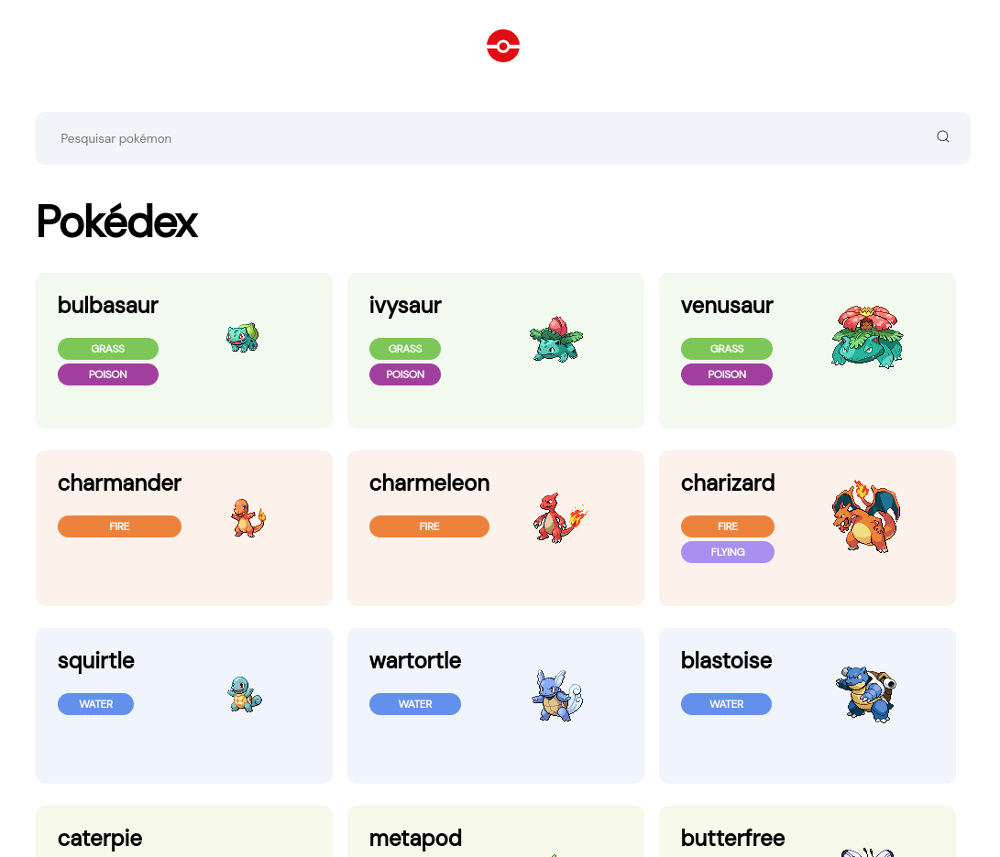
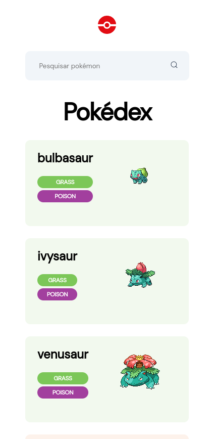
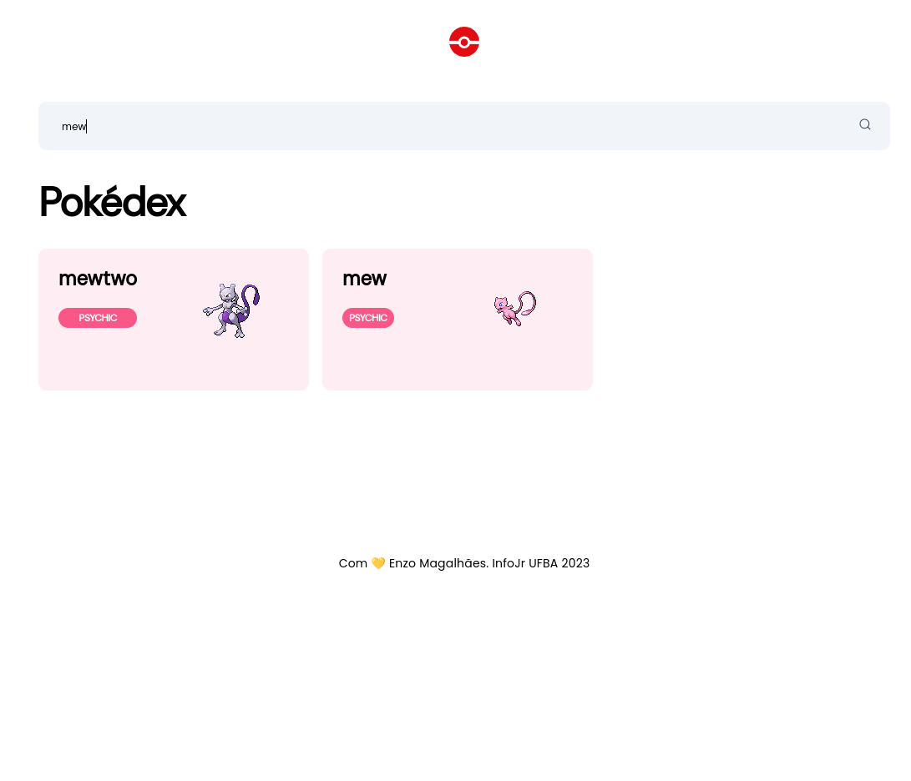

# Projeto Pokedex em Next.js

Este projeto foi desenvolvido por mim como parte do processo seletivo da InfoJr, utilizando Next.js e TypeScript para criar uma visualização da Pokedex. A aplicação consome dados da API do Pokemon ([pokeapi.co](https://pokeapi.co/)) para exibir informações sobre os Pokemons.

## Interface Principal

## Interface Versão Mobile

## Funcionalidade de Filtrar por Nome

## Como Executar o Projeto
1. Clone o repositório: `https://github.com/enzoMagalhaes/Nextjs-Pokedex.git`
2. Instale as dependências: `npm install`
3. Inicie a aplicação: `npm run dev`
4. Abra o navegador e acesse `http://localhost:3000`

## Recursos Utilizados
- Next.js
- TypeScript
- API do Pokemon ([pokeapi.co](https://pokeapi.co/))
